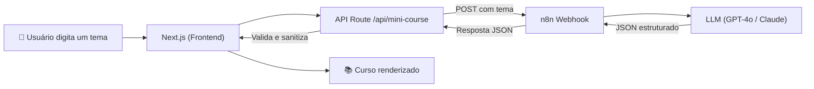

<p align="center">
  
  
  
  
</p>

# TinyLesson 📚✨

### Plataforma de Micro-Learning com Inteligência Artificial

O **TinyLesson** gera mini-cursos completos e interativos sobre qualquer tema em segundos. O usuário digita um tópico, a IA cria um guia estruturado com módulos, quizzes e glossário — tudo com um design premium e responsivo.

> 💡 **Conceito:** O front-end em **Next.js** envia o tema para uma **API Route** interna, que repassa a requisição para um workflow no **n8n**. O n8n orquestra uma LLM (GPT-4o / Claude) que retorna o conteúdo do curso em JSON estruturado, renderizado instantaneamente na interface.

---

## ✨ Funcionalidades

| Funcionalidade | Descrição |
|---|---|
| 🤖 **Geração via IA** | Cursos completos criados sob demanda com 5 módulos, lições e quizzes |
| 🧩 **Quizzes Interativos** | Perguntas de fixação com feedback imediato e explicações |
| 📊 **Progresso Visual** | Barra de progresso global baseada nos quizzes respondidos |
| 🎉 **Celebração** | Confetti animado + modal de conclusão ao completar 100% |
| 📄 **Exportar PDF** | Baixe o curso gerado como documento PDF |
| ⭐ **Avaliação** | Avalie os cursos gerados (persistido via localStorage) |
| 🌗 **Temas Dinâmicos** | Modo Light (textura de papel) e Modo Dark (céu estrelado animado) |
| 📱 **Responsivo** | Layout adaptado para mobile e desktop |

---

## 🏗️ Arquitetura — Como Next.js e n8n se conectam

O projeto segue uma arquitetura desacoplada onde o **Next.js cuida de todo o front-end e o n8n é responsável pela lógica de IA no backend**, sem necessidade de um servidor próprio.



### 🔵 Next.js (Front-end + Proxy)

- **Interface**: Página única com busca, renderização dos módulos, quizzes e sidebar (objetivos, glossário, dicas).
- **API Route** (`/api/mini-course`): Atua como **proxy seguro** entre o navegador e o n8n. Recebe o tema, chama o webhook, valida o JSON retornado e sanitiza os dados antes de enviar para o cliente.
- **Validação robusta**: Extração de JSON tolerante a markdown, normalização de campos ausentes, retry automático com barra de progresso simulada.
- **State**: Hook `useMiniCourse` gerencia todo o estado do curso (navegação, progresso, completude). Store Zustand (`useCourseStore`) persiste histórico e avaliações.

### 🟠 n8n (Backend de IA)

- **Webhook**: Recebe `POST { "theme": "..." }` e inicia o workflow.
- **AI Agent**: Conectado a uma LLM (GPT-4o ou Claude 3.5 Sonnet) com prompt pedagógico pré-configurado.
- **Output Parser**: Força a resposta em JSON Schema estruturado (título, objetivos, 5 módulos com lições e quiz, glossário, dicas).
- **Resposta**: Retorna `{ "output": { ... } }` com o curso completo para o Next.js processar.

> Os arquivos `n8n_agent_setup.md`, `n8n_output_schema.md` e `prompt-agent.md` neste repositório contêm toda a configuração necessária para replicar o workflow.

---

## 🛠️ Tech Stack

| Camada | Tecnologia |
|---|---|
| Framework | [Next.js 15](https://nextjs.org/) (App Router + Turbopack) |
| Estilização | [Tailwind CSS 4](https://tailwindcss.com/) |
| Componentes UI | [Shadcn/UI](https://ui.shadcn.com/) + [Radix](https://www.radix-ui.com/) |
| Animações | [Framer Motion](https://www.framer.com/motion/) |
| Ícones | [Lucide React](https://lucide.dev/) |
| Estado Global | [Zustand](https://zustand.docs.pmnd.rs/) (com persistência) |
| PDF | html2canvas + jsPDF |
| Backend IA | [n8n](https://n8n.io/) (Webhook + AI Agent + Structured Output) |
| Deploy | [Vercel](https://vercel.com/) |

---

## 📂 Estrutura do Projeto

```
src/
├── app/
│   ├── api/
│   │   ├── mini-course/route.ts    # Proxy para n8n (valida e sanitiza JSON)
│   │   └── generate-proxy/route.ts # Proxy alternativo
│   ├── globals.css                 # Design tokens, temas Light/Dark, animações
│   ├── layout.tsx                  # Layout raiz (ThemeProvider)
│   └── page.tsx                    # Página principal (Hero, Search, Curso, Quizzes)
├── components/
│   ├── CourseModule/               # Renderização dos módulos e quizzes
│   ├── SearchInput/                # Campo de busca com submit
│   ├── PdfGenerator/               # Botão de exportação em PDF
│   ├── Rating/                     # Modal de avaliação por estrelas
│   ├── GenerationLoader.tsx        # Loader animado com ícone de cérebro
│   ├── theme-toggle.tsx            # Toggle Light/Dark
│   └── ui/                         # Componentes Shadcn (Button, Card, Alert...)
├── hooks/
│   └── useMiniCourse.ts            # Hook principal (fetch, retry, progresso)
├── store/
│   └── useCourseStore.ts           # Zustand Store (histórico + avaliações)
└── services/
    └── api.ts                      # Service layer auxiliar
```

---


## 📄 Licença

Distribuído sob a licença **MIT**. Veja o arquivo [LICENSE](./LICENSE) para mais detalhes.

---

<p align="center">
  Feito com 🧡 por <a href="https://www.targetweb.tech" target="_blank">Maicon Brendon</a> · <a href="https://instagram.com/maicon.tsx" target="_blank">@maicon.tsx</a>
</p>
