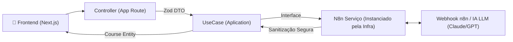

<p align="center">
  
  
  
  
  
</p>

# TinyLesson 📚✨

### Plataforma de Micro-Learning com Inteligência Artificial

O **TinyLesson** gera mini-cursos completos e interativos sobre qualquer tema em segundos. O projeto funciona sob uma arquitetura robusta e escalável, concebida para demonstrar a aplicação estrita de princípios **SOLID** e do padrão **Clean Architecture** aplicados ao ecossistema moderno do Next.js (App Router).

## 🏗️ Arquitetura e Engenharia de Software

Este projeto foi intencionalmente refatorado para servir como um **estudo de caso técnico de alto nível**, separando totalmente as regras de negócio das tecnologias externas (Frameworks, ORMs e Serviços de IA).

### Camadas da Clean Architecture no Projeto:

1. **🟡 Domain Layer (`src/domain`)**
   - O coração da plataforma. Totalmente agnóstico a Next.js ou React.
   - Contém as métricas de _Entities_ puras (ex: `Course.ts`).
   - Define _Interfaces_ de _Repositories_ estipulando os contratos (Inversão de Dependência) que as camadas externas devem cumprir (`CourseGeneratorRepository.interface.ts`).
   - Mapeia catálogos de exceções customizadas estendendo a classe base nativa Error para identificação segura de domínios (`DomainError.ts`).

2. **🔴 Application Layer (`src/application`)**
   - Lida exclusivamente com os Casos de Uso (_UseCases_) da aplicação.
   - Protegida por **DTOs** validados em tempo de execução via **Zod** (Fail-fast strategy).
   - Orquestra a requisição usando as abstrações geradas no Domínio, nunca importando Fetch ou Axios diretamente (`GenerateMiniCourseUseCase.ts`).

3. **🔵 Infrastructure Layer (`src/infra`)**
   - Atua como uma camada de Adapters (Adapters Pattern), concentrando as integrações com serviços externos e o tratamento de dados não estruturados que entram no sistema.
   - Comunica-se com o webhook do **n8n**, lidando com possíveis inconsistências (como retornos em Markdown misturado com JSON). É responsável por fazer o parsing, sanitização e normalização desses dados brutos antes de injetá-los no Domínio (`N8nCourseGenerator.ts`).
   - Gerencia a conversão das requisições web nativas do Next.js através de *Controllers* dedicados (`CourseController.ts`), isolando o roteamento da lógica de negócios.

---

## 🧪 Qualidade de Código & Testes

A manutenibilidade é guiada por uma malha forte de segurança:

- **100% Type-Safe**: Tolerância zero ao tipo `any`. Erros são capitulados com precisão usando `catch (error: unknown)` combinados com Type Guards (`error instanceof Error`).
- **Test-Driven Design (Vitest)**: Rotinas essenciais de lógica são cobertas por Testes Unitários ultrarrápidos, rodando sob a engine do Vitest e simulando Webhooks usando o pattern de **Fake Repositories** na raiz de testes (`tests/fakes/FakeCourseGeneratorRepository.ts`).
- **Composição Visual**: Componentes de Layout são ultra granulares, evitando prop drillling severo e utilizando hooks de manipulação customizados e eficientes.

---

## 🚀 Fluxo de Geração via n8n

A mágica no Back-End ocorre a partir do nosso _infrastructure service_ consumindo a orquestração IA:



_*(Todas as documentações, schemas e setups utilizados no Workflow do n8n para importar localmente se encontram anexos na pasta `/docs` deste repositório.)*_

---

## 🛠️ Tech Stack & Ferramental

| Camada / Função | Tecnologia |
|---|---|
| Framework Web | **Next.js 15** (App Router) |
| Tipagem e Lógica | **TypeScript** (Strict Mode) |
| Validação de DTOs | **Zod** |
| Ambiente de Testes | **Vitest** |
| Componentes & CSS | **Tailwind CSS 4** + **Shadcn/UI** + **Radix** |
| Animação (Micro-interactions)| **Framer Motion** + **Canvas Confetti** |
| Engine Backend IA | **n8n** (Automated Workflow Webhooks) |

---

## 📂 Estrutura do Novo Diretório

A base de código agora espelha a arquitetura limpa:

```text
/
├── docs/                # Arquivos JSON do n8n, relatórios e planos de sistema
├── tests/               
│   ├── fakes/           # Repositórios Simulados para Teste em Memória
│   └── unit/            # Suites do Vitest testando as Applicaton UseCases
├── src/                 # Fonte Aplicação V2 Solid
│   ├── app/             # Rotas de Layout do Next.js 
│   ├── application/     # Camada Application (UseCases, DTOs Zod)
│   ├── components/      # UI Modular (Framer, Shadcn, etc)
│   ├── domain/          # Entidades Core e Contratos
│   ├── hooks/           # Encapsulamento de Lifecycle Components do React
│   ├── infra/           # Serviços (n8n), Adapters e HTTP Controllers
│   ├── lib/             # Core utils Next / Tailwind
│   └── store/           # Zustand - Persistence & Cache
```

## 📄 Licença
Distribuído sob a licença **MIT**. Veja o arquivo [LICENSE](./LICENSE) para mais detalhes.

---
<p align="center">
  Feito com foco em Design e Clean Code por <a href="https://www.targetweb.tech" target="_blank">Maicon Brendon</a> · <a href="https://instagram.com/maicon.tsx" target="_blank">@maicon.tsx</a>
</p>
